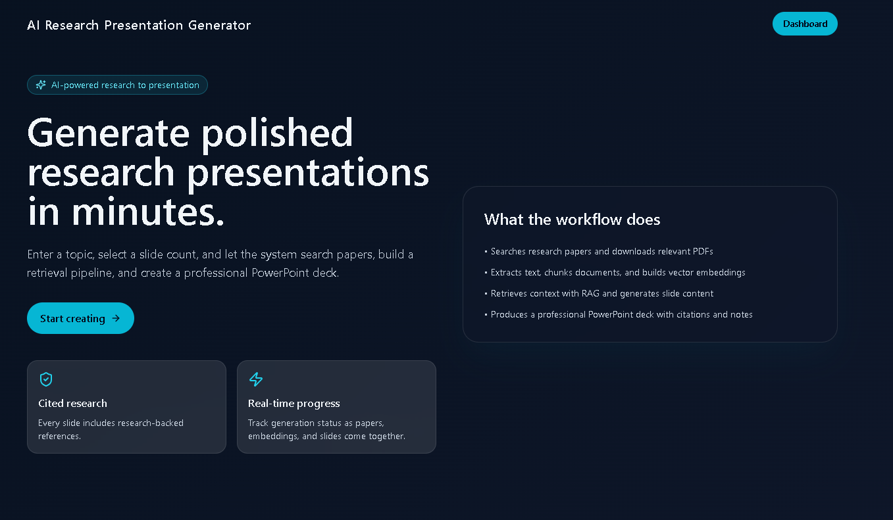
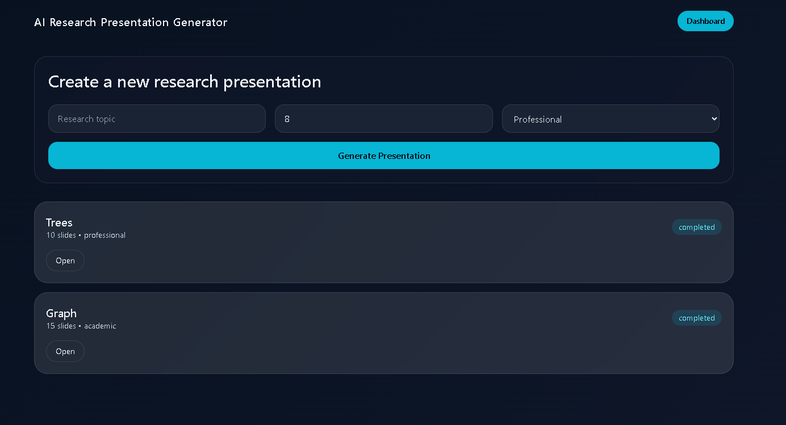
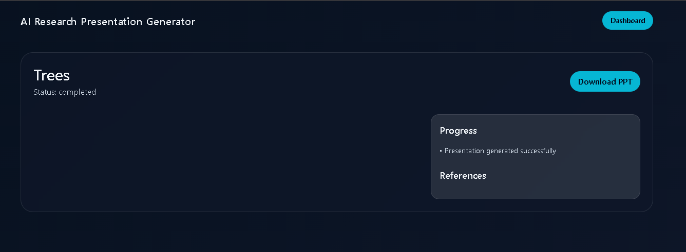

# AI Research Presentation Generator

AI Research Presentation Generator is a full-stack application that turns a research topic into a slide deck. It combines a FastAPI backend, a React/Vite frontend, MongoDB, Redis, Qdrant, and an AI pipeline that can search research sources, process uploaded PDFs, generate slide content, and export a PowerPoint presentation.

## What the project does

The app is designed to take a topic, slide count, and presentation style, then run a research workflow that builds a structured presentation. The backend stores project data, tracks progress, and exposes the generated `.pptx` file for download. Users can also upload PDF documents to provide extra source material for the pipeline.

## Main features

- Create a research presentation project from a topic, slide count, and style.
- Upload PDF files to support the research workflow.
- Track project status through the backend API.
- Retrieve generated slides, references, logs, and presentation files.
- Run the app locally with Python and Node.js or with Docker Compose.

## Architecture

The project is split into two main parts:

- Backend: FastAPI application in [backend/app](backend/app).
- Frontend: React application in [frontend/src](frontend/src).

The backend includes routers, services, repositories, database integration, and an asynchronous worker flow. The frontend provides the user interface for managing projects and viewing results.

## Backend overview

Key backend entry points and responsibilities:

- [backend/app/main.py](backend/app/main.py) creates the FastAPI app and registers routes.
- [backend/app/routers/projects.py](backend/app/routers/projects.py) handles project creation, listing, status checks, deletion, and downloads.
- [backend/app/routers/uploads.py](backend/app/routers/uploads.py) handles PDF uploads.
- [backend/app/services/pipeline.py](backend/app/services/pipeline.py) runs the research and generation workflow.
- [backend/app/models/project.py](backend/app/models/project.py) defines the project and slide data models.
- [backend/app/core/config.py](backend/app/core/config.py) loads environment settings.

## Frontend overview

The frontend is a Vite-based React app with Tailwind CSS. Current pages include:

- Landing page
- Dashboard
- Project details view

Frontend dependencies are managed from [frontend/package.json](frontend/package.json).

## API endpoints

Backend routes currently exposed by the application:

- `GET /health` - health check
- `POST /projects` - create a new presentation project
- `GET /projects` - list all projects
- `GET /projects/{project_id}` - get full project details
- `DELETE /projects/{project_id}` - delete a project
- `GET /projects/{project_id}/status` - get current project status
- `GET /projects/{project_id}/download` - download the generated PowerPoint file
- `POST /upload/pdf` - upload a PDF document

## Project data model

Projects track the following core fields:

- `topic`
- `slide_count`
- `presentation_style`
- `status`
- `created_at`
- `updated_at`
- `ppt_path`

Detailed project responses also include generated slides, references, and logs.

## Environment variables

Create a `.env` file in the backend or provide environment variables before starting the app.

Required and supported variables:

- `APP_NAME`
- `APP_VERSION`
- `GEMINI_API_KEY`
- `MONGODB_URI`
- `JWT_SECRET`
- `REDIS_URL`
- `QDRANT_URL`
- `QDRANT_API_KEY`
- `ARXIV_API_KEY`
- `UPLOAD_DIR`
- `MAX_UPLOAD_SIZE_MB`

Defaults are defined in [backend/app/core/config.py](backend/app/core/config.py), but API keys and service URLs should be configured for real deployments.

## Local setup

### Backend

1. Create and activate a Python virtual environment.
2. Install dependencies:

```powershell
pip install -r backend/requirements.txt
```

3. Start the backend from the `backend` directory:

```powershell
uvicorn app.main:app --reload
```

### Frontend

1. Install frontend dependencies:

```powershell
cd frontend
npm install
```

2. Start the development server:

```powershell
npm run dev
```







## Docker

The repository includes a Docker Compose stack with backend, worker, frontend, MongoDB, Redis, and Qdrant services.

Run it from the project root with:

```powershell
docker compose -f docker/docker-compose.yml up --build
```

## Repository structure

- `backend/` - FastAPI app, worker code, models, repositories, and tests.
- `frontend/` - React user interface.
- `docker/` - Dockerfiles and Compose configuration.

## Notes

- PDF uploads are accepted only through the backend upload endpoint.
- Generated presentations are returned as `.pptx` files.
- The backend uses MongoDB for persistence, Redis/RQ for background work, and Qdrant for vector search support.

## Testing

Backend tests live under [backend/tests](backend/tests). If you want, I can also add a short testing section with the exact commands for this repo once I confirm the test runner setup.

## Live Link

https://research-gpt-ashy.vercel.app/
